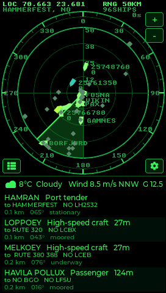
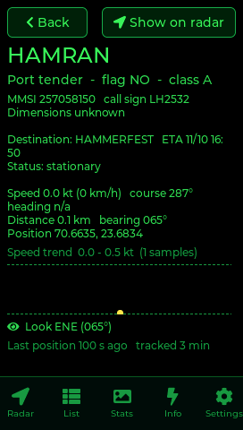
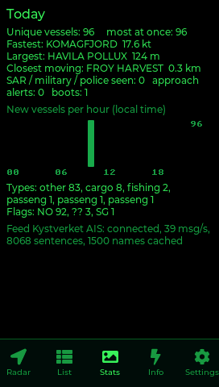
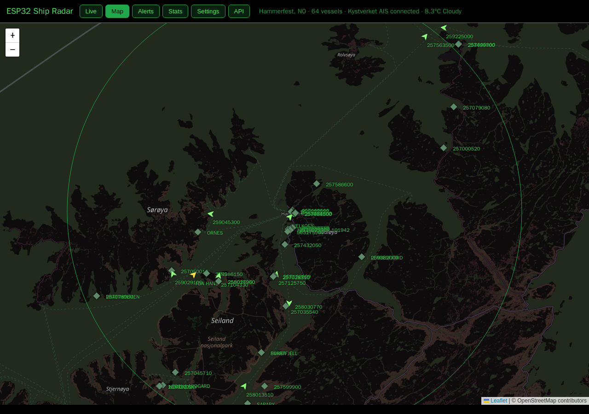
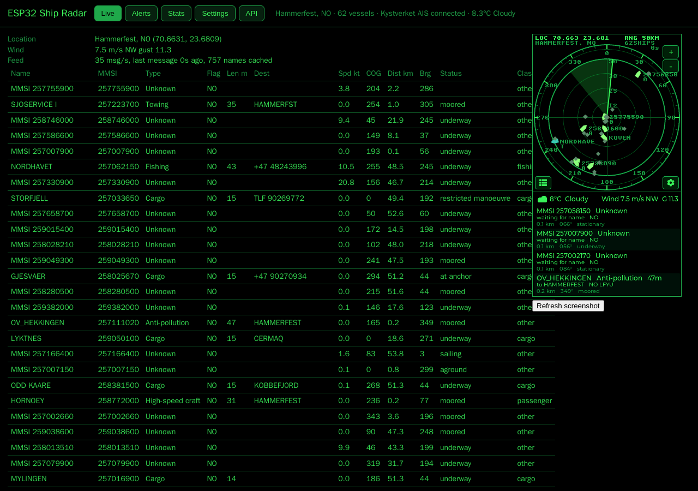
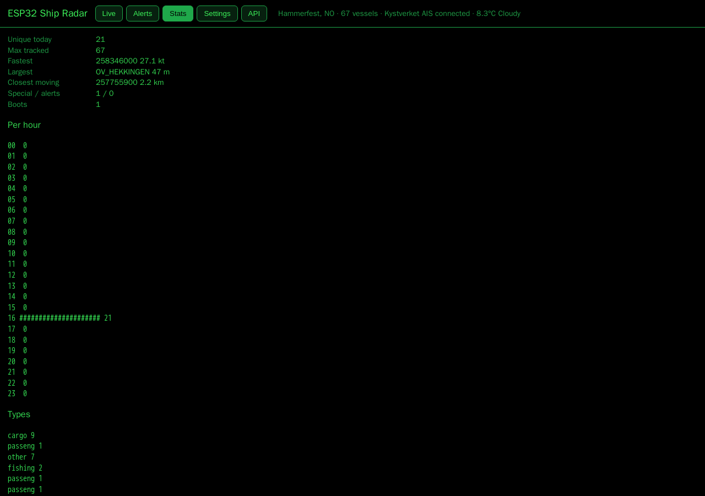

# ESP32 Ship Radar

A live vessel radar for the **[JC4827W543](https://www.aliexpress.com/item/1005006729377800.html)** board (ESP32-S3, 4.3″ 480×272 touch display used in portrait), the
sister project of [esp32-adsb-radar](https://github.com/frogswiper/esp32-adsb-radar). It shows the ships around you
on a green HUD-style radar fed by the **open Kystverket AIS feed** for Norwegian waters. No API key, no account.

| Radar | Vessel detail | Stats |
|---|---|---|
|  |  |  |

## Features

- **Radar view (top 60 %)** – range rings 5–200 km, graduated bezel, rotating sweep, vessels drawn as hull
  silhouettes pointing along their heading (diamonds when stationary), sized by ship length, trails, name labels,
  tankers orange, SAR / military / law enforcement red. Coastline, lakes and borders as a dotted map underlay
  (Natural Earth 10m, embedded) and harbour markers for the Oslofjord and southern Scandinavia.
- **Closest four (bottom 40 %)** – name, ship type, length; destination, flag and call sign; distance, bearing,
  speed, course and navigational status. Weather icon, temperature and condition left, wind with gusts right.
- **Vessel detail page** – tap a row: type, flag, class, MMSI, call sign, dimensions, draught, destination with
  ETA, status, speed / course / heading, position, speed trend sparkline, closest approach.
- **Approach alert** – closest-point-of-approach for every moving vessel; pulsing ring, flashing row, banner and
  optional full backlight.
- **Watchlist** – comma-separated name / MMSI / call sign prefixes drawn in gold and announced on arrival;
  SAR, military and police vessels are always announced.
- **Vessel classes** – cargo, tanker, passenger, fishing, pleasure, other: own tints, each can be hidden.
- **Push notifications** – [ntfy.sh](https://ntfy.sh) topic and/or a JSON webhook for watchlist arrivals,
  special vessels and approach alerts. Alert history on the device.
- **Web panel** at `http://esp32-shipradar.local` – live table and screenshot, a **map** (OpenStreetMap tiles, every
  vessel with heading, trails, popups, harbour markers; click a row or a vessel to highlight it), alerts, statistics,
  every setting (with a Wi-Fi scan list), Prometheus `/metrics`, **OTA firmware updates** armed from the Info page.
  Optional password.
- **MQTT / Home Assistant** – discovery adds nearest vessel, distance, counts, alerts and fastest vessel as sensors.
- **Statistics page** – unique vessels and new vessels per hour, fastest, largest, closest, types and flags.
- **Own AIS receiver** – point it at any NMEA TCP stream (rtl_ais, AIS-catcher) instead of the Kystverket feed.
- **Location** – automatic from the public IP, or continent → country → city pickers, a typed city, or coordinates.
  Wi-Fi is entered on the device; credentials saved by the ADS-B radar or DeskClock firmware are inherited.
- All network I/O on core 0 (a FreeRTOS task keeps the TCP stream open and decodes NMEA on the fly); LVGL on core 1.

## Data sources

| Purpose | Service |
|---|---|
| Vessels | Kystverket open AIS feed, raw NMEA 0183 over TCP (`153.44.253.27:5631`), decoded on the device: message types 1.2.4/18/19 (position), 5/24 (name, type, dimensions, destination) |
| IP geolocation | ip-api.com (HTTP), fallback ipwho.is |
| Country list | embedded, generated from ISO-3166 (`src/countries.h`) |
| City list | countriesnow.space, top cities by population |
| City → coordinates | Open-Meteo geocoding |
| Timezone, temperature, wind | Open-Meteo forecast |
| Map underlay | embedded Natural Earth 10m coastline / lakes / borders within 520 km of Hønefoss (`src/map_data.h`) |
| Harbours | embedded table (`src/ports.h`) |

The feed carries all Norwegian AIS traffic (about 40 sentences per second). The device decodes every sentence,
keeps positions inside the current range, and caches names and static data for every MMSI it hears so vessels
entering range are named immediately.

## Hardware

### Get the board

**[JC4827W543 on AliExpress](https://www.aliexpress.com/item/1005006729377800.html)** (Guition ESP32-S3 4.3″ display board). Choose the **capacitive-touch
version (JC4827W543C, GT911)** — the firmware drives the GT911; the resistive variant (JC4827W543R) will show the
screen but touch won't work. Any USB cable with data lines is enough to flash and power it.

| Component | Detail |
|---|---|
| Board | Guition JC4827W543**C** (capacitive) |
| SoC | ESP32-S3, 240 MHz dual core, Wi-Fi 2.4 GHz + BLE |
| Memory | 4 MB flash, 8 MB PSRAM (OPI) |
| Display | 4.3″ 480×272 NV3041A over QSPI, used rotated to 272×480 portrait |
| Touch | GT911 capacitive, I²C |
| USB | native USB-Serial/JTAG (flashing, serial console, power) |

## Flash from the browser

No IDE needed, Chrome or Edge: **https://frogswiper.cloud/esp32-ship-radar/**

## Build and flash

```bash
cd firmware
pio run -t upload --upload-port /dev/ttyACM0
pio device monitor
```

### Serial debug commands (115200 baud)

| Key | Action |
|---|---|
| `S` | dump the screen as raw RGB565 (`scripts/screenshot.py`) |
| `1`–`5` | switch to Radar / List / Stats / Info / Settings |
| `T` | open the detail page for the nearest vessel |
| `L` | re-locate by public IP |
| `C<city>,<cc>` | set location by city, e.g. `CHønefoss,NO` |
| `D` | reset settings (keeps Wi-Fi) and reboot |
| `R` | reboot |

## Project structure

```
firmware/src/
├── main.cpp                # setup/loop, event dispatch, scheduling, serial commands
├── ais.cpp/h               # AIS NMEA decoder, stream task, vessel model, name cache, lookups
├── ports.h                 # harbour markers
├── map_data.h              # Natural Earth coastline/lakes/borders around Hønefoss
├── geo.cpp/h, net_task.*   # IP geolocation, cities, geocoding, weather; WiFi + command queue
├── display.*, settings.*, ntp.*, countries.h, net_util.*
└── ui/                     # radar, list, detail, info, settings pages
```

## Licences

LovyanGFX, LVGL, ArduinoJson, TouchLib – MIT. Montserrat – SIL OFL. UNSCII – public domain. Natural Earth –
public domain. AIS data courtesy of Kystverket (Norwegian Coastal Administration), NLOD licence.

## Web panel and HTTP API

Open `http://esp32-shipradar.local`. Tabs: Live, Map, Alerts, Stats, Settings, API.





 Endpoints: `GET /api/state`
(vessels with trails, feed statistics, weather, location), `GET|POST /api/config`, `GET /api/alerts`, `GET /api/stats`,
`GET /api/wifi/scan`, `GET /api/ports`, `GET /screen.bmp`, `GET /metrics`, `POST /api/action`, `POST /ota` (armed on the device first).
A panel password in Settings protects everything with HTTP Basic Auth (user `admin`).

Features in this release were inspired by [esp32flight](https://github.com/theqkash/esp32flight).
